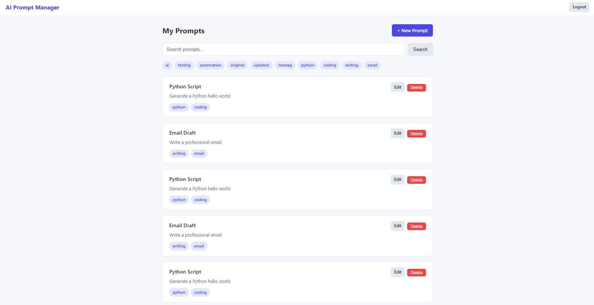

# AI Prompt Manager

<p align="center">
  
  
  
  
  
  
  
  
  
</p>

<p align="center">
  
  
  
  
</p>

A web application for managing AI prompts — create, edit, delete, search, and test prompts with a built-in mock AI response feature.

Built as a portfolio project to demonstrate **end-to-end test automation skills** using industry-standard tools: Selenium WebDriver, Cucumber.js (BDD/Gherkin), Docker, Jenkins CI/CD, and Allure Reports.

---

## App Screenshot

<p align="center">
  
</p>

---

## Tech Stack

| Layer | Technology |
|---|---|
| Backend | Node.js, Express |
| Templates | EJS |
| Database | SQLite (better-sqlite3) |
| Testing | Selenium WebDriver, Cucumber.js (Gherkin) |
| CI/CD | Jenkins |
| Reporting | Allure Reports |
| Containers | Docker, docker-compose |
| Linting | ESLint (flat config) |

---

## Features

- Login page (any credentials accepted — demo app)
- Create, read, update, and delete prompts
- Each prompt has a title, body, and comma-separated tags
- Keyword search across title and body
- Tag filtering — click any tag to filter the list
- "Ask AI" button on each prompt — sends the prompt to a mock endpoint and displays a simulated response without reloading the page

---

## Project Structure

```
ai-prompt-manager/
├── app.js                  # Entry point — starts the Express server
├── package.json            # Dependencies and npm scripts
├── cucumber.js             # Cucumber runner config (features, steps, Allure reporter)
├── Dockerfile              # Container image for the app
├── docker-compose.yml      # App + Selenium Chrome services
├── Jenkinsfile             # 5-stage CI/CD pipeline definition
├── src/
│   ├── db.js               # SQLite database setup
│   └── routes/
│       ├── auth.js         # Login / logout
│       ├── prompts.js      # CRUD for prompts (search + tag filter)
│       └── ai.js           # Mock AI response endpoint
├── views/                  # EJS templates
│   ├── login.ejs
│   ├── index.ejs           # Prompt list
│   ├── create.ejs
│   ├── edit.ejs
│   ├── detail.ejs          # Single prompt + Ask AI
│   └── 404.ejs
├── public/
│   └── css/style.css
├── test/
│   ├── features/           # Gherkin .feature files (5 features, 14 scenarios)
│   ├── step-definitions/   # Selenium step definitions
│   ├── pages/              # Page Object Model classes
│   └── support/            # World setup, hooks, Allure environment config
└── docs/                   # Test evidence — Allure exports (PDF + CSV)
```

---

## Quick Start — Docker (Recommended)

This is the fastest way to run the app and the full test suite without installing anything beyond Docker.

### Prerequisites

- [Docker Desktop](https://www.docker.com/products/docker-desktop/) (or Docker Engine + docker-compose on Linux)
- Node.js v18+ — only needed to run `npm run test:docker` and generate the report locally

### 1. Clone and start the containers

```bash
git clone https://github.com/rprecigapuentes/ai-prompt-manager.git
cd ai-prompt-manager
docker compose up -d
```

This starts two containers:
- `ai-prompt-manager` — the Express app on port `3000`
- `selenium-chrome` — Selenium Grid with headless Chrome on port `4444`

Verify both are running:

```bash
docker compose ps
```

The app is available at `http://localhost:3000/login`.

### 2. Install local dependencies

```bash
npm install
```

This installs Cucumber, Allure CLI, and Selenium WebDriver locally — needed to drive the tests and generate the report.

### 3. Run the test suite

```bash
npm run test:docker
```

This script:
1. Detects the app container's internal IP
2. Runs all 14 Cucumber scenarios using the Selenium Grid container
3. Writes Allure result files to `allure-results/`

Expected output:
```
Running tests against APP_URL=http://172.x.x.x:3000 via SELENIUM_URL=http://localhost:4444
.............................................................................................................................

14 scenarios (14 passed)
97 steps (97 passed)
0m25.045s
```

### 4. Generate the Allure report

```bash
npm run report
```

This reads `allure-results/` and generates a full HTML report in `allure-report/`.

### 5. View the Allure report

```bash
python3 -m http.server 5050 --directory allure-report
```

Open `http://localhost:5050` in your browser.

> **Note for WSL2 users:** use `localhost` (not `127.0.0.1`) in your Windows browser.

### 6. Stop the containers

```bash
docker compose down
```

---

## Local Development (Without Docker)

### Prerequisites

- Node.js v18+ (install with [nvm](https://github.com/nvm-sh/nvm))
- Google Chrome (required for local Selenium tests)

### Install & Run

```bash
npm install
npm start
```

Open `http://localhost:3000/login`. Sign in with any username and password.

### Run lint

```bash
npm run lint
```

### Run tests locally

**Terminal 1:**
```bash
npm start
```

**Terminal 2:**
```bash
npm test
```

Then generate and view the report:

```bash
npm run report
python3 -m http.server 5050 --directory allure-report
```

---

## CI/CD Pipeline (Jenkinsfile)

The `Jenkinsfile` defines a 5-stage pipeline:

| Stage | Command | Purpose |
|---|---|---|
| Install | `npm ci` | Install exact dependency versions |
| Lint | `npm run lint` | Enforce code quality before tests |
| Build | `docker-compose build` | Build the app image |
| Test | `npm test` | Run all 14 Cucumber scenarios |
| Report | `npm run report` | Generate and publish Allure report |

---

## Test Automation Framework

### Structure

| Directory | Purpose |
|---|---|
| `test/features/` | 5 Gherkin feature files written in plain English |
| `test/step-definitions/` | JavaScript functions connecting Gherkin steps to Selenium actions |
| `test/pages/` | Page Object Model — one class per page, encapsulates all selectors and actions |
| `test/support/` | Cucumber World (WebDriver setup), Before/After hooks, Allure environment writer |

### Feature files and scenarios

| Feature | Scenarios |
|---|---|
| `create-prompt.feature` | Create with all fields, create without tags, fail without title |
| `list-prompts.feature` | View all, search by keyword, filter by tag, clear filters |
| `edit-prompt.feature` | Edit title/body, edit tags, fail without title |
| `delete-prompt.feature` | Delete from list, delete from detail page |
| `ai-response.feature` | Ask AI and receive response, button presence check |

**Total: 14 scenarios, 97 steps**

### Page Object Model classes

| Class | Page covered |
|---|---|
| `BasePage.js` | Shared helpers: `click`, `type`, `getText`, `isVisible`, `waitForVisible` |
| `LoginPage.js` | Login form |
| `HomePage.js` | Prompt list, search, tag cloud |
| `CreatePage.js` | Create prompt form |
| `DetailPage.js` | Prompt detail, edit form, Ask AI |

---

## Test Results: From 35.71% to 100%

On the first real browser run, **5 of 14 scenarios passed (35.71%)**. The remaining 9 failed due to bugs in the test code. Each was diagnosed from the Allure report and fixed.

| # | Bug | Root cause | Fix |
|---|---|---|---|
| 1 | Step timeout | Cucumber's 5s default is too short for headless Chrome | `setDefaultTimeout(30000)` |
| 2 | `confirm()` dialog crashed Selenium | Native browser dialogs block DOM access | `driver.switchTo().alert().accept()` |
| 3 | Server validation never triggered | HTML5 `required` blocks submit at browser level | `form.noValidate = true` via `executeScript` |
| 4 | Edit button clicked Logout | `a.btn-secondary` matched Logout first in DOM | Changed selector to `a[href*="/edit"]` |
| 5 | Deleted prompt still visible | DB accumulated duplicates from failed runs | `BeforeAll` hook truncates DB |
| 6 | Navigation race condition | `driver.get()` called before login redirect finished | `driver.wait(until.urlIs('/'))` after login |

**Final result: 14/14 scenarios passing (100%)**

### Allure report evidence

| File | Description |
|---|---|
| [`docs/allure-report-35.71%.pdf`](docs/allure-report-35.71%.pdf) | First run — 5/14 passing |
| [`docs/allure-report-100%.pdf`](docs/allure-report-100%.pdf) | Final run — 14/14 passing |
| [`docs/data_behaviors_allure_35.71%.csv`](docs/data_behaviors_allure_35.71%.csv) | Scenario data export — first run |
| [`docs/data_behaviors_allure_100%.csv`](docs/data_behaviors_allure_100%.csv) | Scenario data export — final run |

---

## Author

Rosemberth Steeven Preciga Puentes
